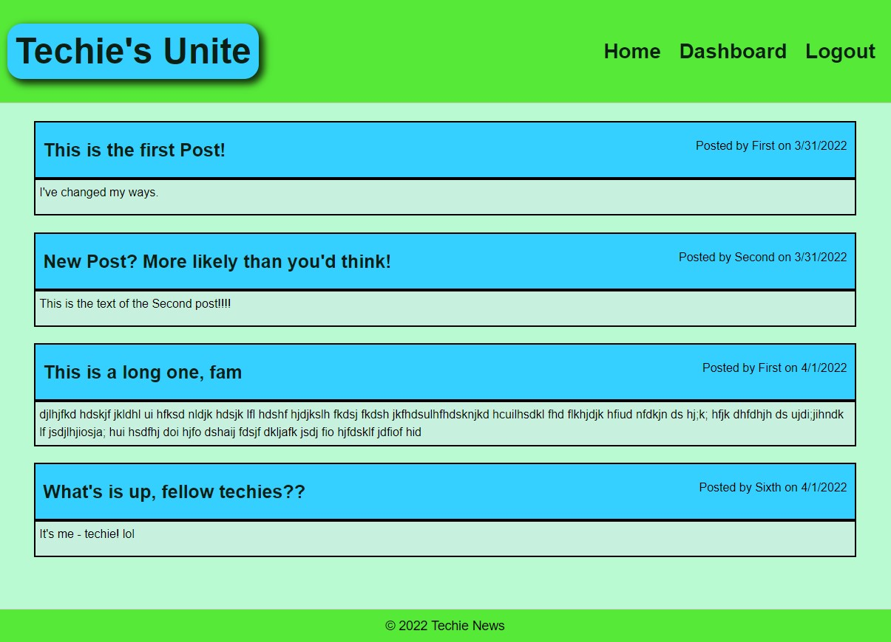

# Model-View-Controller (MVC) Challenge: Tech Blog

## Description

```
The client requested that a CMS-style blog be built to give a platform
to developers to publish blog posts and comment on other posts about
technology and coding. It needed to be deployed to Heroku and must
use an MVC-paradigm.
```

## User Story

```
AS A developer who writes about tech
I WANT a CMS-style blog site
SO THAT I can publish articles, blog posts, and my thoughts and opinions
```

## Acceptance Criteria

```
- It is done when the homepage includes existing blog posts, navigation
links for the homepage and the dashboard, and the option to log in.

- It is done when the user is unable to access the dashboard or add
comments to the posts until the user is logged in.

- It is done when the user is required to sign-up using a username and
password, which can then be used later to log in to the site.

- It is done when the user, after logging in, can leave comments on
existing blog posts, create new blog posts, and edit the user's existing
blog posts.

- It is done when the user is signed out of the website after being idle
for a set time.
```

The following image demonstrates the application functionality:



## Review

You are required to submit the following for review:

- The URL of the functional, deployed application: https://rhubarb-cupcake-18535.herokuapp.com/
- The URL of the GitHub repository: https://github.com/sstover25/e-commerce-back-end

---

## Installation

```
To use this application, you must have the following installed:
- Node.js
- dotenv
- express
- express-handlebars
- bcrypt
- express-session
- connect-session-sequelize
- mysql2
- sequelize
```

## Credits

```
Coding assistance from KU bootcamp modules, the TA office hours, MDN, https://sequelize.org/,
and Stack Overflow.
```

© 2021 Trilogy Education Services, LLC, a 2U, Inc. brand. Confidential and Proprietary. All Rights Reserved.
